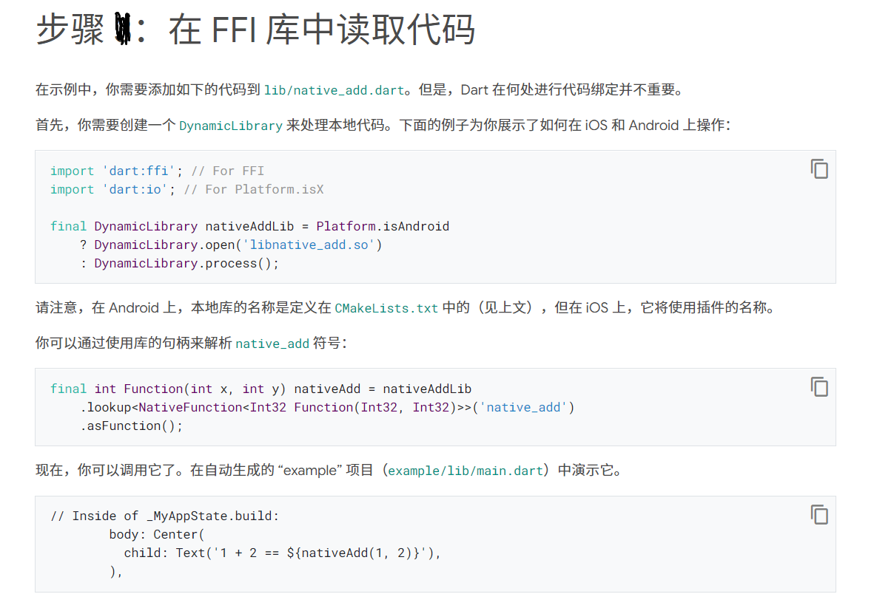

# Flutter 项目（Android）中使用 C++ 编写的函数库（不支持类导出）

两大步骤：
1. 用 Flutter 打包 C++ 源代码为其生态下的一个插件；
2. 在 Flutter 项目实际使用该插件；

## 制作插件

下面为插件项目的初始化语句，插件目标使用平台为 安卓，iOS 这里为存放 C++ 源代码使用；

```bash
flutter create --platforms=android,ios --template=plugin create_flutter_cxx_package
```

### 编写 C++ 功能源代码

略过~ --- 具体可看 `create_flutter_cxx_package` 该项目代码，C++ 代码放置于 `/ios/Classes/` 目录下；

### 将 C++ 代码导出的库链接到 Android

在根目录下 android 目录中创建一个 CMakeLists.txt 文件用来定义如何编译源文件

```cmake
cmake_minimum_required(VERSION 3.4.1)  # for example

add_library(hello

             # Sets the library as a shared library.
             SHARED

             # Provides a relative path to your source file(s).
             ../ios/Classes/hello.cpp )
```

还需要添加一个 externalNativeBuild 到 android/build.gradle 文件中

```gradle
android {
  // ...
  externalNativeBuild {
    // Encapsulates your CMake build configurations.
    cmake {
      // Provides a relative path to your CMake build script.
      path "CMakeLists.txt"
    }
  }
  // ...
}
```

### 在 FFI 库中读取代码

这一部分就直接看[官方文档](https://flutter.cn/docs/development/platform-integration/android/c-interop)介绍更详细



`create_flutter_cxx_package` 项目的可看 Git 的代码变动了解；

## 在 Flutter 项目中使用该插件

在 VSCode 下直接使用 Flutter 插件开启一个新的 Flutter 项目 `flutter_use_cxx_demo`；

根据 Flutter 的[外部依赖包引入规则](https://flutterchina.club/using-packages/)：

1. 这里将该 Flutter 项目与前一步骤制作的插件项目处于同一个层级目录下；
2. 修改该 Flutter 项目的包配置文件 `pubspec.yaml`，加入以下语句（最后两行），具体可看项目的 Git 代码变动；

```yaml
dependencies:
  flutter:
    sdk: flutter

  # The following adds the Cupertino Icons font to your application.
  # Use with the CupertinoIcons class for iOS style icons.
  cupertino_icons: ^1.0.2
  create_flutter_cxx_package:
    path: ../create_flutter_cxx_package
```

最后修改项目的 `main.dart` 文件，使用 `sayHello()` 函数；

具体看 Git 代码变动；

## 参考链接

[Android 上使用 dart:ffi 调用本地代码](https://flutter.cn/docs/development/platform-integration/android/c-interop)

[在 flutter 上使用 c 代码 - (一) 有源码的项目](https://blog.csdn.net/qq_28478281/article/details/102899983?depth_1-utm_source=distribute.pc_relevant.none-task&utm_source=distribute.pc_relevant.none-task) -- 其中的简单总结是个问题；

